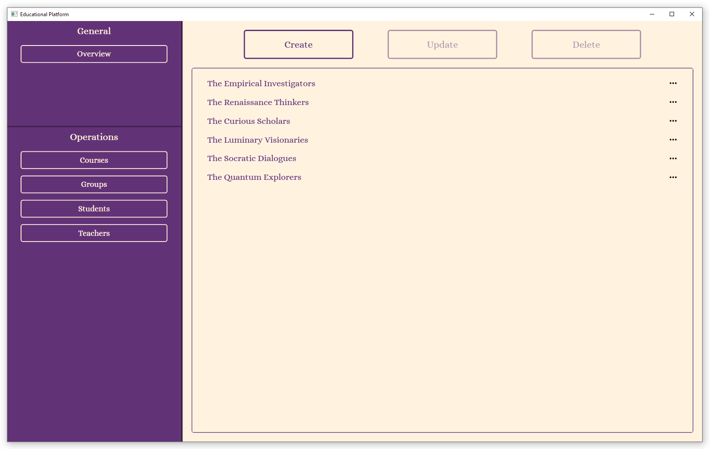

<!-- ABOUT THE PROJECT -->

## About The Project

This project is a learning platform for students and teachers. The application allows you to view all courses in a tree structure (along with related groups and students). In addition, it is possible to create, edit, and delete courses, groups, students, and teachers. It is worth adding that the program provides a convenient user interface that synchronizes different windows when creating a particular entity in the user interface. In addition, the application works with a database, the connection string to which is located in the appsetting.json file. Finally, the program provides the ability to import group students from a csv file and export to it, as well as other formats, including pdf and docx.

<!-- GETTING STARTED -->

<br><br>

## Installation

_Follow these steps to get the program set up and running correctly._
<br>

1. Clone the repo

```sh

git clone https://github.com/DmytroHoliaka/edu-platform.git

```

2. Go to the catalog with the main project

```sh

cd edu-platform/EduPlatform.WPF

```

3. Compile and run the project

```sh

dotnet run

```


<!-- ROADMAP -->

<br><br>

## Short demonstration

The application demonstrates a number of features. I will discuss the main ones below.

1. View courses, groups, and students in a tree structure:
<div align="center">
  
</div>

2. View individual courses, groups, students, and teachers (similar pages for other entities):
<div align="center">
  
</div>

3. Each of the entities has three main actions: create, update and delete (similar form for updating):
<div align="center">
  
  
  
  
</div>

4. Ability to perform additional actions with groups:
<div align="center">
  
</div>

5. Export to csv, docx and pdf formats (photos in the appropriate order)
<div align="center">
  
  
  
</div>

<br>

<div align=center>
<h3>
	Note: These are not all possible features, try it to learn more.
</h3>
</div>


